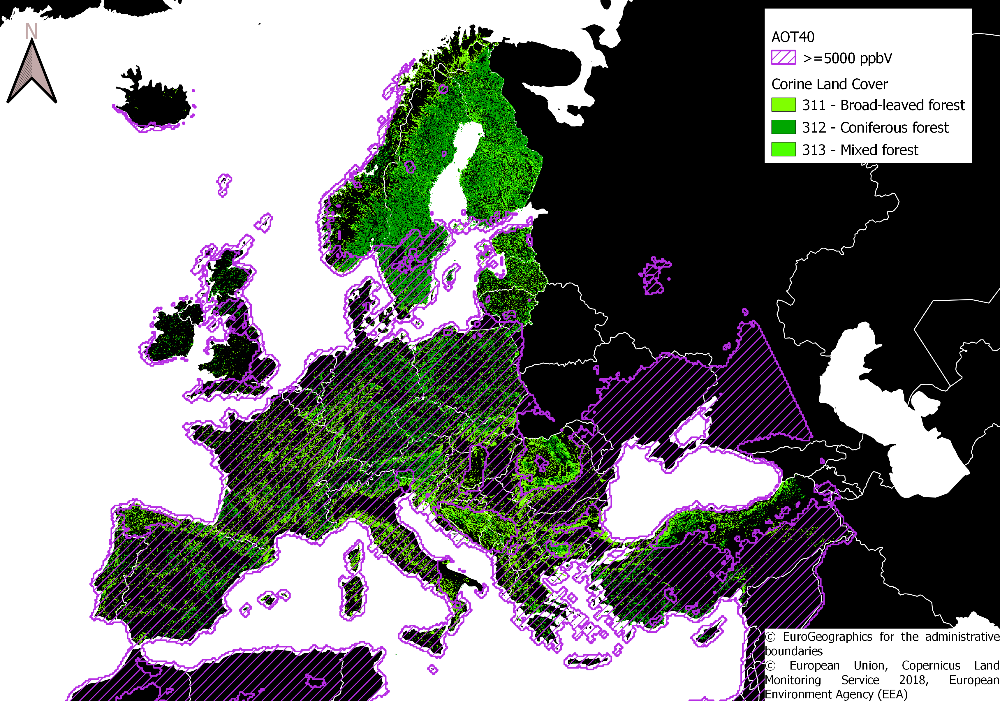

# Copernicus Uptake Exam repository
Exam material for POLIMI PhD course Copernicus Uptake 2021

## Project Description
In this project, the Copernicus Atmospheric Monitoring Service ([CAMS](https://atmosphere.copernicus.eu/)) ensemble air quality model estimations are used to compute the impact indicators for vegetation health due to NOX, SO2 and O3 concentrations over Europe. Then, Copernicus [CORINE LAND COVER](https://land.copernicus.eu/pan-european/corine-land-cover) is used to identify natural areas where AQ indicators for vegetation are exceeded.

>*Exposure to O3 of Forests in Europe*

## Content of this repository

### PROJ_DOCS
This directory contains the Exam proposal text and PPT presentation of the project. 

### COD_R
This directory contains all R codes used in the project

### DATA_O3
This directory contains:
- The code used to download the CAMS model concentration from the Atmosphere Data Store ([ADS](https://ads.atmosphere.copernicus.eu/#!/home))
- The code used to compute the AOT40 starting from the CAMS model output
- The raster and shapefiles created during the project to map natural areas exposure to poor air quality
- The maps and the csv results of the analysis
- Data, boxplot and the map of the NDVI analysis on the forest sample area. Kruskall-Wallis Test resuslt can be found using [NDVI_check.R](./COD_R/NDVI_check.R)

### DATA_NOx and DATA_SO2
These directories follow the same structure of **DATA_O3**. (Download and processing code, raster and maps)
